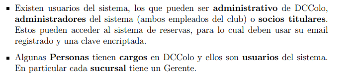

# Informe Entrega 1 - Bases de datos IIC2413

## Datos del Alumno

| **Apellidos**       | **Nombres**          | **Número de Alumno** |
|---------------------|----------------------|----------------------|
| Huenchul Guzmán | Benjamín Esteban    |25663046              |

## 0.1 Consideraciones aplicadas (supuestos)

- se asume que usuarios solo sean usuarios del sistema (trabajadoes), apartados de los socios regulares ya que el enunciado no lo deja claro. (se dice que usuarios del sistema son empleados del club o socios titulares, pero luego se dice que usuarios del sistema son aquellos con cargos en DCColo, lo que no incluye a los socios titulares):


- se asume que invitado_evnto solo depende del evento al que fue invitado y no de la persona que la invitara al envento como tal (entidad debil dependiente de que exista un evento)
- se asume que solo puede haber una sucursales en una comuna
- se asume que un contacto de una empresa solo pertenece a una empresa, sin embargo una empresa puede tener multiples contactos, cardinalidad 1:n (vi una respuesta a una issue que decia que eran n:n pero lo vi muy tarde, cuando ya habia modelado casi en su totalidad la base de datos y realizado alguna de las consultas T.T)
- se asume que los atributos del esquema E/R seran observados en el modelo entidad relacion normalizado, esto por temas de visibilidad del propio esquema (la cantidad de elementos en el esquema empeora notablemente la visibilidad, clariadad y entendimiento de este)
- se asume que la forma de representar el esquema relacional normalizado a BCNF sera la siguiente:

    &nbsp;&nbsp;&nbsp;&nbsp;Entidad(atributo_1 PK, atributo_2 FK -> entidad_referenciada(atributo_relacionado), atributo_3, etc...)

## 1. Descripción y análisis del problema

El principal problema consistio en construir una base (o mejor dicho esquema) de datos para el Club DCColo, que básicamente necesita poder registrar todo lo que pasa en el club, asi como el manejo de los datos de los socios que pertenecen al club, qué instalaciones tienen disponibles en las distintas sucursales, la capacidad de arrendar estas instalaciones o agendar eventos y permitir manejar el cobro de las membresías.

Los usuarios del club (en este caso, usuarios como todas las personas que se relacionan con el club) se debian modelar en más de una entidad, ya que existen usuarios titulares que son aquellos que reciben los cobros de las membresias, beneficiarios que no pagan pero dependen del titular, adicionales que generan un cobro extra para el titular, etc... El club cuenta con varias sucursales, y cada una tiene sus propias tarifas tanto de membresía como de arriendo de lugares, los cuales tienen precios cambiantes según el día y la hora, lo que obliga a modelar las tarifas de forma separada y con vigencia ya que ademas los registros de cobro, uso y reservas deben quedar registrados para su posterior uso (variable segun las consultas que deseemos realizar).

## 2. Solución aplicada

La idea central de la solución fue modelar a todas las personas del sistema bajo una entidad Persona la cual sirve como directorio común, y desde ahí usar jerarquías para separar los distintos roles. Evitando asi tener que repetir atributos como el RUN, nombre, correo y teléfono en cada subtipo, asi los socios heredan de "persona" y a su vez se dividen en Titular, Beneficiario y Adicional, los cuales tienen reglas de negocio muy distintas entre sí, Lo mismo aplica para los Usuarios del sistema, que se dividen en Administradores y Gerentes (socios titulares no pertenecen a usuarios del sistema por lo aclarado en la seccion 0.1 "Consideraciones aplicadas (supuestos)").

Para el tema de las tarifas, se crearon dos entidades separadas: Tarifa_lugar para los precios de arriendo (que varían por lugar, día, hora y vigencia) y Tarifa_sucursal para los valores de membresía (que varían por sucursal). Esto permite actualizar un precio sin tocar los registros históricos de cuotas o reservas ya emitidas.

La entidad "reserva" concentra todos los arriendos, tanto pasados, presentes o futuros con un atributo de estado que indica si se ejecutó o no, ademas los eventos se modelan aparte porque tienen datos propios (código único, nombre, contratante) pero siempre generan una reserva de lugar, por lo que se conectan a "reserva" mediante la relación Genera. Así no se duplica la lógica de ocupación de lugares.

Para los contratantes de eventos se usaron dos relaciones separadas (Persona_realiza_evento y Empresa_realiza_evento, estas dos relaciones generan tablas a pesar de ser relaciones 1:n, el porque de esto se explica en la parte de referencias) ya que el enunciado dice que puede ser persona o empresa, y modelarlo con una sola relación lo haria más dificil de mantener sin perder la logica principal del esquema (esto en mi caso ya que son demaciadas cosas a considerar).

Finalmente, los asistentes a eventos se modelaron como entidad débil Invitado_evento porque solo existen en el contexto de un evento específico y se guardan datos mínimos de ellos, por lo que su identificación solo depende del evento al que asisten.

### 2.1 Modelo Entidad Relación


### 2.2 Modelo Entidad Relación normalizado

- Region(codigo_region PK, nombre)

- Comuna(codigo_comuna PK, nombre, codigo_region FK -> Region(codigo_region))

- Sucursal(id_sucursal PK, nombre, direccion, codigo_comuna FK -> Comuna(codigo_comuna))

- Lugar(id_lugar PK, nombre, tipo, capacidad, unidad_cobro, id_sucursal FK -> Sucursal(id_sucursal))

- Tarifa_lugar(id_tarifa PK, id_lugar FK -> Lugar(id_lugar), dia_semana, hora_inicio, hora_fin, valor, fecha_inicio_vigencia, fecha_fin_vigencia)

- Tarifa_sucursal(id_tarifa PK, id_sucursal FK -> Sucursal(id_sucursal), tipo_socio, valor, fecha_inicio, fecha_fin)

- Persona(RUN PK, nombre_completo, correo, direccion_calle, codigo_comuna FK -> Comuna(codigo_comuna), telefono_celular, telefono_alternativo)

- Socios(RUN PK FK -> Persona(RUN), fecha_incorporacion, fecha_fin_membresia)

- Titular(RUN PK FK -> Socios(RUN), estado)

- Beneficiario(RUN PK FK -> Socios(RUN), fecha_nacimiento, tipo_parentesco, RUN_titular FK -> Titular(RUN))

- Adicionales(RUN PK FK -> Socios(RUN), fecha_nacimiento, tipo_parentesco, RUN_titular FK -> Titular(RUN))

- Cuotas(id_cuota PK, RUN_titular FK -> Titular(RUN), id_tarifa FK -> Tarifa_sucursal(id_tarifa), numero_cuota, monto, fecha_vencimiento, fecha_pago, estado)

- Invitado_socio(RUN PK, nombre_completo, correo, telefono)

- Invita_a(RUN_socio PK FK -> Socios(RUN), RUN_invitado PK FK -> Invitado_socio(RUN), fecha_visita PK, id_lugar FK -> Lugar(id_lugar))

- Reserva(id_reserva PK, RUN_socio FK -> Socios(RUN), id_lugar FK -> Lugar(id_lugar), fecha_inicio, hora_inicio, fecha_fin, hora_fin, monto_total, monto_pagado, estado, n_asistentes)

- Evento(codigo_evento PK, id_reserva FK -> Reserva(id_reserva), nombre, fecha, estado)

- Empresa_realiza_evento(codigo_evento PK FK -> Evento(codigo_evento), RUT_empresa FK -> Empresa(RUT), RUN_contacto FK -> Contacto_empresa(RUN))

- Persona_realiza_evento(codigo_evento PK FK -> Evento(codigo_evento), RUN_persona FK -> Persona(RUN))

- Empresa(RUT PK, nombre)

- Contacto_empresa(RUN PK FK -> Persona(RUN), RUT_empresa FK -> Empresa(RUT), cargo)

- Usuarios(RUN PK FK -> Persona(RUN), email, clave_encriptada)

- Administradores(RUN PK FK -> Usuarios(RUN))

- Gerentes(RUN PK FK -> Usuarios(RUN), id_sucursal FK -> Sucursal(id_sucursal), fecha_inicio_cargo, fecha_fin_cargo)

- Invitado_evento(identificador PK, codigo_evento PK FK -> Evento(codigo_evento), nombre)

### 2.3 Consultas SQL
\- los comentarios dentro del codigo fueron para guiarme a la hora de realizar las consultas, los cuales decidi dejar para evideciar en cierta medida el proceso llevado a cabo en la entrega

a)

```sql
SELECT
    --tabla con atributos (dia, fecha, hora, lugar, persona_que_reserva)
    TO_CHAR(r.fecha_inicio, 'Day') AS dia,
    DATE(r.fecha_inicio) AS fecha,
    r.hora_inicio AS hora,
    l.nombre AS lugar,
    CASE    
        WHEN e.nombre IS NOT NULL THEN e.nombre 
        ELSE p.nombre_completo 
    END AS evento_o_reservante
FROM Reserva r
JOIN Lugar l ON l.id_lugar = r.id_lugar
JOIN Sucursal s ON s.id_sucursal = l.id_sucursal
LEFT JOIN Evento e ON e.id_reserva = r.id_reserva
LEFT JOIN Socios so ON so.RUN = r.RUN_socio
LEFT JOIN Persona p ON p.RUN = so.RUN
--filtro por la fecha pedida
WHERE s.nombre = 'Santa Cruz'
  AND DATE(r.fecha_inicio) BETWEEN '2026-04-06' AND '2026-04-12'
ORDER BY DATE(r.fecha_inicio), r.hora_inicio, l.nombre; 
```

b)

```sql

WITH sucursal_sc AS (
    --tabla con atributos (id_sucursal, codigo_comuna) [datos de la sucursal Santa cruz]
    SELECT id_sucursal, codigo_comuna 
    FROM Sucursal 
    WHERE nombre = 'Santa Cruz'
),

--atributo concepto corresponde a la procedencia del dinero genrado
--ingresos por la membresia de la sucursal
ingresos_membresia AS (
    SELECT
        -- tabla con atributos (concepto, estado_ingreso, monto_recaudado)
        'Membresia' AS concepto,
        CASE WHEN c.estado = 'pagada' THEN 'Recibido' ELSE 'Esperado' END AS estado_ingreso,
        c.monto AS monto_recaudado
    FROM Cuotas c
    JOIN Titular t ON t.RUN = c.RUN_titular
    JOIN Persona p ON p.RUN = t.RUN
    JOIN sucursal_sc s ON p.codigo_comuna = s.codigo_comuna
    --donde la fecha corresponde al mes y año actual
    WHERE EXTRACT(MONTH FROM c.fecha_vencimiento) = EXTRACT(MONTH FROM CURRENT_DATE)
      AND EXTRACT(YEAR FROM c.fecha_vencimiento) = EXTRACT(YEAR FROM CURRENT_DATE)
),

--ingresos por arriendo de la sucursal
ingresos_arriendo AS (
    SELECT 
        --tabla con atributos (concepto, estado_ingreso, monto)
        'Arriendo' AS concepto,
        'Recibido' AS estado_ingreso,
        r.monto_pagado AS monto
    FROM Reserva r
    JOIN Lugar l ON r.id_lugar = l.id_lugar
    JOIN sucursal_sc s ON l.id_sucursal = s.id_sucursal
    --filtramos con el mes y año actual, ademas de asegurarnos de que la reservano sea por un evento 
    WHERE EXTRACT(MONTH FROM r.fecha_inicio) = EXTRACT(MONTH FROM CURRENT_DATE)
      AND EXTRACT(YEAR FROM r.fecha_inicio) = EXTRACT(YEAR FROM CURRENT_DATE)
      AND NOT EXISTS (SELECT 1 FROM Evento e WHERE e.id_reserva = r.id_reserva)
    
    --union encargado de unir ambas tablas (union all para evitar el borrado de datos accidentales)
    UNION ALL
    
    SELECT 
        --tabla con los mismos atributos que la tabla de arriba pero para los cobros pendientes
        'Arriendo' AS concepto,
        'Esperado' AS estado_ingreso,
        (r.monto_total - r.monto_pagado) AS monto
    FROM Reserva r
    JOIN Lugar l ON r.id_lugar = l.id_lugar
    JOIN sucursal_sc s ON l.id_sucursal = s.id_sucursal
    --filtramos por las mismas condiciones que la tabla anterior y que sean reservas no ejecutadas
    WHERE EXTRACT(MONTH FROM r.fecha_inicio) = EXTRACT(MONTH FROM CURRENT_DATE)
      AND EXTRACT(YEAR FROM r.fecha_inicio) = EXTRACT(YEAR FROM CURRENT_DATE)
      AND r.estado != 'ejecutada'
      AND NOT EXISTS (SELECT 1 FROM Evento e WHERE e.id_reserva = r.id_reserva)
)

--tabla con atributos (concepto, el estado del ingreso y el total recaudado en la sucursal)
SELECT concepto, estado_ingreso, SUM(monto_recaudado) AS total
FROM (
    SELECT * FROM ingresos_membresia
    UNION ALL
    SELECT * FROM ingresos_arriendo
) consolidado
GROUP BY concepto, estado_ingreso;


```

c)

```sql

SELECT 
    p.nombre_completo, 
    p.RUN, 
    su.nombre AS sucursal, 
    SUM(c.monto) AS monto_total_adeudado, 
    COUNT(c.id_cuota) AS numero_cuotas_atrasadas
FROM Cuotas c
JOIN Titular t ON t.RUN = c.RUN_titular
JOIN Persona p ON p.RUN = t.RUN
JOIN Sucursal su ON p.codigo_comuna = su.codigo_comuna
WHERE c.estado = 'atrasada'
GROUP BY p.nombre_completo, p.RUN, su.nombre
ORDER BY p.nombre_completo;


```

d)

```sql

SELECT 
    pb.RUN AS run_beneficiario, pb.nombre_completo AS nombre_beneficiario, pb.correo, pb.telefono_celular,
    pt.RUN AS run_titular, pt.nombre_completo AS nombre_titular
FROM Beneficiario b
JOIN Socios sb ON sb.RUN = b.RUN
JOIN Persona pb ON pb.RUN = b.RUN
JOIN Titular ti ON ti.RUN = b.RUN_titular
JOIN Socios st ON st.RUN = ti.RUN
JOIN Persona pt ON pt.RUN = ti.RUN
WHERE b.tipo_parentesco = 'hijo'
  AND (EXTRACT(YEAR FROM st.fecha_fin_membresia) - EXTRACT(YEAR FROM b.fecha_nacimiento)) = 29;


```

e)

```sql
--para esta consulta alomejor tome casos muy "edge" tipo si me daban valores null y cosas asi
-- las cuales me pude haber ahorrado, pero considero que me ayudaron a entender de mejor 
--manera el como solucionar el problema de forma mas general 

WITH Ingresos_Membresias_2025 AS (
    SELECT su.id_sucursal, SUM(c.monto) AS total_membresias
    FROM Sucursal su
    JOIN Comuna co ON su.codigo_comuna = co.codigo_comuna
    JOIN Persona p ON p.codigo_comuna = co.codigo_comuna
    JOIN Socios so ON p.RUN = so.RUN
    JOIN Titular t ON so.RUN = t.RUN
    JOIN Cuotas c ON t.RUN = c.RUN_titular
    WHERE EXTRACT(YEAR FROM c.fecha_pago) = 2025
    GROUP BY su.id_sucursal
),

Ingresos_Reservas_2025 AS (
    SELECT l.id_sucursal, SUM(r.monto_pagado) AS total_reservas
    FROM Reserva r
    JOIN Lugar l ON r.id_lugar = l.id_lugar
    WHERE EXTRACT(YEAR FROM r.fecha_inicio) = 2025
    GROUP BY l.id_sucursal
),

Ingresos_Sucursal_Totales AS (
    SELECT su.id_sucursal, su.nombre AS nombre_sucursal,
        --uso de COALESE() para el manejo de valores null (caso en el que no existan reservas), tq para evitar errores logicos los remplazamos por 0
        COALESCE(im.total_membresias, 0) + COALESCE(ir.total_reservas, 0) AS ingreso_total
    FROM Sucursal su
    --juntamos los ingresos que obtuvimos en las tablas anteriores
    LEFT JOIN Ingresos_Membresias_2025 im ON su.id_sucursal = im.id_sucursal
    LEFT JOIN Ingresos_Reservas_2025 ir ON su.id_sucursal = ir.id_sucursal
),

--ingresos totales que genero el club con reservas (eventos y arriendos) y membresias
Gran_Total_Club AS (
    SELECT SUM(ingreso_total) AS total_club 
    FROM Ingresos_Sucursal_Totales
),

Ultimo_Inicio_Gerente_2025 AS (
    --en caso de que haya mas de un gerente en un año, obtenemos al mas reciente (del 2025) con MAX (recordar que no devolvemos a los gerentes, si no la id_sucursal y la fecha en la que inicio su cargo)
    SELECT id_sucursal, MAX(fecha_inicio_cargo) AS max_fecha
    FROM Gerentes
    WHERE EXTRACT(YEAR FROM fecha_inicio_cargo) <= 2025
    GROUP BY id_sucursal
),

Gerente_Vigente_2025 AS (
    --teniendo la fecha de inicio de su cargo, obtenemos finalmente a cada gerente correspondiente a su sucursal 
    SELECT g.id_sucursal, p.nombre_completo AS nombre_gerente
    FROM Gerentes g
    JOIN Ultimo_Inicio_Gerente_2025 wi --porque uig suena como wi :P
      ON g.id_sucursal = wi.id_sucursal AND g.fecha_inicio_cargo = wi.max_fecha
    JOIN Persona p ON g.RUN = p.RUN
)

SELECT 
    --tabla final del reporte, atributos: (nombre_de_la_sucursal, nombre_gerente_a_cargo, ingresos_totales_sucursal, porcentaje_generado_respecto_a_fondos_totales)
    ist.nombre_sucursal, COALESCE(gv.nombre_gerente, 'Sin Gerente') AS gerente_a_cargo, ist.ingreso_total,
    ROUND((ist.ingreso_total * 100.0 / gt.total_club), 2) AS porcentaje_del_total
FROM Ingresos_Sucursal_Totales ist
--cross join para poder utilizar el total de ingresos del club en el calculo del porcentaje de ingresos de la sucursal (como es una tabla con una sola fila y columna, no deberia de afectar en gran medida el rendimiento, ya que solo le coloca a cada registro de insgresos de la sucursal el total al lado)
CROSS JOIN Gran_Total_Club gt
LEFT JOIN Gerente_Vigente_2025 gv ON ist.id_sucursal = gv.id_sucursal
ORDER BY ist.ingreso_total DESC;


```


## 3. Referencias y bibliografía externa

- consulta a gemini pro (utilizado para una duda respecto a la vinculacion de las dos relaciones de registro de eventos, lo que explica porque en el esquema existe una tabla para la relacion de registro eventos cuando esta es una relacion 1:n):

Prompt utilizado: "una foreign key puede estar vacia?, te pongo un ejemplo, hay dos relaciones las cuales una va desde una entidad persona y otra desde entidad empresa, y van a parar a evento mediante "persona _realiza_evento" y "empresa_realiza_evento" como son tablas con cardinalidad 1:n, la key de persona y empresa se las lleva la entidad evento, pero un evento no puede ser realizado por una empresa y una persona al mismo tiempo, por lo que una de las foreign key no va a tener la key respectiva, como funciona esto?, genera algun error?"

respuesta: "Para ir directo al grano: Sí, una Llave Foránea (Foreign Key) puede estar vacía (tener un valor NULL). No genera ningún error en la base de datos a menos que tú, como programador, le agregues la restricción explícita de que no pueda estar vacía (NOT NULL). pero puede dar a errores logicos.
 Solucion: En lugar de ensuciar la tabla Evento con atributos nulos, dejas la tabla Evento limpia y creas tablas para registrar quién lo realizó.

\- Evento(codigo_evento PK, nombre...) -> No tiene FKs de quién lo organiza.

\- Persona_realiza_evento(codigo_evento PK FK, RUN_persona FK)

\- Empresa_realiza_evento(codigo_evento PK FK, RUT_empresa FK)

Por qué es buena: Cumple a la perfección con la normalización (BCNF) porque eliminas por completo los valores nulos (NULL). Cada tabla tiene solo la información que le corresponde."

- Sitios que me ayudaron con algunos comandos:

-https://neon.com/postgresql/tutorial/cte

-https://www.w3schools.com/sql/func_mysql_extract.asp

-https://www.postgresql.org/docs/current/functions-conditional.html#FUNCTIONS-COALESCE-NVL-IFNULL
